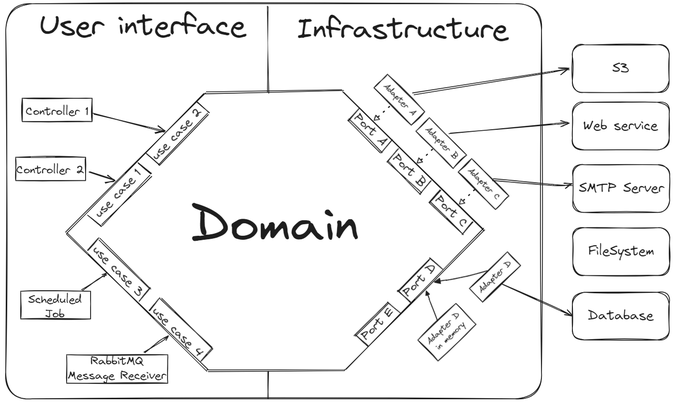

# Architecture Overview

This document is the architectural contract of the project. It defines the layers, the dependency rules between them, and the shape of the building blocks (use cases, ports, adapters, endpoints). Every rule states its rationale and the mechanism that enforces it.

This is a **rule-driven architecture, not a suggestion-only architecture**: every rule below is enforced by the compiler, an analyzer, or an architecture test. If a rule and the enforcement ever disagree, fix the enforcement — do not bypass the rule.

## 1. Architecture Style: Hexagonal (Ports and Adapters)

> **Concept primer.** Hexagonal architecture organizes code around one idea: *business logic must not know how the outside world talks to it or how it talks to the outside world.* The business logic lives in the center (the "hexagon", here called the **domain**). The domain declares **ports** — plain interfaces expressing what it needs ("store a user", "get the current time") or offers. **Adapters** on the outside implement those ports for a concrete technology (HTTP, PostgreSQL, JWT, system clock). All dependencies point *inward*: adapters know the domain; the domain never knows the adapters.



*Reading the diagram in this project's terms: the left side ("user interface") is our **Api layer** — endpoints and scheduled tasks that drive the domain; the center hexagon is the **Domain layer** — use cases surrounded by ports; the right side is the **Infra layer** — adapters implementing those ports against real technology (database, external services). Every arrow points inward toward the domain.*

Two kinds of adapters exist:

- **Driving adapters** (inbound): translate an external trigger into a domain call — HTTP endpoints, scheduled tasks.
- **Driven adapters** (outbound): implement domain ports against real technology — database repositories, token codecs, clocks, event publishers.

**Why hexagonal:** business rules change on business time; frameworks, protocols, and databases change on technology time. Separating them lets each evolve without breaking the other, and makes business logic testable without booting any infrastructure.

## 2. Layer Model

The application is a single project, organized **feature-first**: folders carry both the feature and its hexagonal layer (see [Project Structure and Conventions](03-project-structure-and-conventions.md)).

| Layer | Location | Responsibility | Owns I/O? |
|---|---|---|---|
| Feature API | `Features/<subdomain>/Api/` | HTTP endpoints, scheduled tasks, feature-level API concerns (mapping, exception handlers) | yes |
| Feature Domain | `Features/<subdomain>/Domain/` | use cases, entities, value objects, domain services, feature ports, domain events | no |
| Common API | `Common/Api/` | host composition (`Program.cs`), security configuration, exception handling, serialization, endpoint conventions | yes |
| Common Domain | `Common/Domain/` | shared domain abstractions: base exception, event contracts, pagination, shared ports and value objects | no |
| Common Infra | `Common/Infra/` | driven adapter implementations, database entities and `DbContext`, technical configuration | yes |
| Common Utils | `Common/Utils/` | generic, domain-agnostic utilities | no |

The rows with **Owns I/O? = no** are the hexagon. Everything they need from the outside world arrives through a port.

## 3. Dependency Direction Rules

All dependencies point inward, toward the domain. Because the application is a single project, these rules are enforced by **architecture tests** (ArchUnitNET) that run before every other test — the same mechanism a single-module codebase uses to hold its layers apart.

The rules:

- **The domain depends on nothing outward.** `Features/<subdomain>/Domain` may reference only the base class library, `System.Collections.Immutable`, `Common/Domain`, and `Common/Utils`. It must not reference any `Api` or `Infra` namespace, nor any framework namespace (`Microsoft.AspNetCore.*`, `Microsoft.EntityFrameworkCore.*`, DI containers). This is the most load-bearing rule of the architecture.
- **Adapters depend on ports, not the reverse.** `Common/Infra` and `Features/<subdomain>/Api` depend inward on domain; fields and constructor parameters are typed as the **port interface**, never a concrete adapter.
- **Features are isolated.** `Features/Users` must not reference `Features/Authentication` types — cross-feature communication goes through integration events. Exception: the `Audit` feature may consume other features' integration events.
- **The domain reads no ambient state.** No wall-clock access, no random generation, no environment reads — these arrive through `ITimeProviderPort`, `IRandomGeneratorPort`, and configuration-bound properties. This keeps domain logic deterministic and unit-testable.
- **Naming and placement** follow section 5 and 6, and the full inventory in [Build Toolchain and Quality Gates](06-build-toolchain-and-quality-gates.md#6-architecture-test-inventory).

**Why architecture tests rather than assembly boundaries:** the architecture is defined by these rules, not by how it is packaged. Encoding them as tests keeps the structure feature-first and readable while making a violation a **failing build** — the rule suite runs first, so a boundary break is the first thing that turns red, before any behavioral test.

**Enforced by:** `tests/ArchitectureTests/*RulesUnitTests` classes (`HexagonalArchitectureRulesUnitTests`, `DesignRulesUnitTests`, and the feature/naming rule classes).

## 4. What Belongs in the Domain vs. in Adapters

The decisive heuristic:

> If the logic could change **when business rules change**, it belongs in the **domain**.
> If the logic could change **when a framework, protocol, or storage technology changes**, it belongs in an **adapter**.

| Domain owns | Adapters own |
|---|---|
| business decisions and branching | protocol translation (HTTP status codes, headers, cookies) |
| invariants and validation of business meaning | serialization and deserialization |
| orchestration across domain concepts and ports | persistence mapping (domain model ↔ database entity) |
| domain events describing what happened | technology exceptions translated into domain exceptions |

✅ Do: put a rule like "a username must be unique" in the domain (as a use-case decision over a port result, or a database-constraint translation in the adapter surfaced as a domain exception).
❌ Do not: branch on business conditions inside an endpoint or repository adapter because it is "closer" — proximity is not ownership.

## 5. Use Case Contract

A **use case** is one business operation, packaged as one class.

```csharp
public class SignupUseCase(
    IUserRepositoryPort userRepository,
    IPasswordEncoderPort passwordEncoder,
    ITimeProviderPort timeProvider,
    IRandomGeneratorPort randomGenerator,
    IEventPublisherPort eventPublisher)
{
    public async Task<User> Handle(SignupCommand command, CancellationToken cancellationToken)
    {
        // business decisions only; all I/O through the injected ports
    }
}
```

Rules:

- Classes live under `Features/<subdomain>/UseCases/<usecase>/`, suffixed `UseCase`.
- Exactly **one** public method, named `Handle`, taking at most one input parameter (a `Command` or `Query` record) plus an optional `CancellationToken`.
- Use cases depend on **ports and domain services**, never on other use cases.
- Use cases carry **no framework attributes** and implement no framework interfaces — they are plain classes.

**Why:** one operation per class keeps use cases small, individually testable, and prevents "service classes" that accrete unrelated behavior. Banning use-case→use-case calls avoids hidden orchestration chains; shared business behavior belongs in a domain service.

**Enforced by:** `tests/ArchitectureTests/Domain/UseCaseRulesUnitTests.cs` (naming, placement, single `Handle`, parameter count) and `HexagonalArchitectureRulesUnitTests.cs` (domain references no framework namespace).

## 6. Endpoint Contract (REPR)

Endpoints follow the **REPR** pattern — **R**equest, **E**ndpoint, **R**esponse:

- **One endpoint class per route.** Each class maps exactly one route and handles exactly one operation.
- The request and response models are **records owned by that endpoint**, named `<Name>EndpointRequest` / `<Name>EndpointResponse`, living in the endpoint's folder. They are never shared across endpoints, even when identical "for DRY".
- Endpoints translate: bind and validate the request shape, call one use case, map the result. **No business branching.**

```csharp
public class SignupEndpoint : IEndpoint
{
    public static void Map(IEndpointRouteBuilder app) =>
        app.MapPost("/auth/public/signup", Handle).AllowAnonymous();

    private static async Task<Created<SignupEndpointResponse>> Handle(
        SignupEndpointRequest request, SignupUseCase useCase, CancellationToken cancellationToken)
    {
        var user = await useCase.Handle(request.ToCommand(), cancellationToken);
        return TypedResults.Created($"/users/{user.Id}", SignupEndpointResponse.From(user));
    }
}
```

Request records carry declarative validation attributes for **transport shape** (required, length, format). Business invariants are still validated in the domain — transport validation is a convenience gate, not the source of truth.

**Why:** endpoint-local transport models make every API contract explicit and independently evolvable; sharing them couples endpoints so a change for one silently changes another. One class per route keeps handlers discoverable by URL.

**Enforced by:** `tests/ArchitectureTests/Api/EndpointConventionRulesUnitTests.cs` and `RequestResponseConventionRulesUnitTests.cs` (naming, placement, locality, field types, validation attributes present on request fields).

### 6.1 Authorization Rule

Authorization is **deny-by-default, declared explicitly, path-signaled**:

1. A global fallback policy requires an authenticated user for any endpoint that declares nothing — forgetting authorization configuration yields a secured endpoint, never an exposed one.
2. Every endpoint must still declare its intent explicitly: `.RequireAuthorization("<policy>")` or `.AllowAnonymous()`. Implicit endpoints do not pass review or the architecture test.
3. `.AllowAnonymous()` is permitted **only** on routes whose path contains `/public/`. The URL itself signals exposure — the rule is path-based, so public surface is auditable by grep.

✅ Do: `app.MapPost("/auth/public/login", …).AllowAnonymous();`
✅ Do: `app.MapGet("/users", …).RequireAuthorization(Policies.Admin);`
❌ Do not: map an endpoint with no authorization metadata and rely on the fallback — the fallback is a safety net, not a convention.
❌ Do not: use `.AllowAnonymous()` on a route without `/public/` in its path.

**Why:** the two most expensive authorization bugs are the forgotten annotation (solved by deny-by-default) and the unauditable public surface (solved by the path convention).

**Enforced by:** the fallback authorization policy in `src/Common/Api/Security/`; `tests/ArchitectureTests/Api/EndpointConventionRulesUnitTests.cs` walks all mapped endpoints and asserts explicit metadata and the `/public/` ⇔ anonymous equivalence.

## 7. Immutability Contract

> **Concept primer.** A `record` is a reference type with value semantics: `init`-only properties, structural equality, and non-destructive updates via `with`. Marking a property `required` forces every construction site to set it — the compiler rejects partially-initialized objects.

- Domain types (entities, value objects, commands, queries, events) are **records** with `required init` properties. There are no setters to misuse and no half-built instances.
- Collections in domain fields and non-private signatures use **immutable types** (`ImmutableList<T>`, `ImmutableHashSet<T>`, `ImmutableDictionary<TKey,TValue>` from `System.Collections.Immutable`). Received collections cannot be mutated by the receiver, returned collections cannot be mutated by the caller.
- **Exemptions:** endpoint request/response records may use arrays or `List<T>` (serializer-friendly transport shapes), and database entities may use mutable collections (change-tracker requirement). These are the boundary types; the exemption stops at the boundary.

**Why:** immutable data cannot be corrupted at a distance; most aliasing and concurrency bugs become unrepresentable. Value objects with validated constructors turn "stringly-typed" data into types that are correct by construction.

**Enforced by:** `tests/ArchitectureTests/DesignRulesUnitTests.cs` (immutable collection types in domain signatures, record usage in domain namespaces), compiler (`required`, `init`).

## 8. Dependency Injection Wiring Strategy

> **Concept primer.** ASP.NET Core has a built-in DI container. Services are registered at startup (`builder.Services.Add…`) and delivered via constructor parameters. There is no annotation scanning by default — registration is explicit code.

- **Use cases register by convention:** a single registration routine scans the application assembly for classes suffixed `UseCase` (under any `Features/*/Domain/UseCases`) and registers them. Use cases therefore carry zero framework attributes and the domain stays framework-agnostic.
- **Adapters register explicitly** against their port interface in the composition root: `services.AddSingleton<ITimeProviderPort, TimeProvider>();`. The port→adapter binding is visible in one place.
- Constructor injection only. No property/field injection, no service locator (`IServiceProvider` resolution inside business code).
- Configuration binds to validated options types (see [Security, Observability and Error Handling](09-security-observability-and-error-handling.md)); domain code receives plain values or domain-owned property records, never `IConfiguration`.

**Why:** convention registration keeps the domain free of infrastructure concerns while avoiding per-use-case boilerplate; explicit adapter bindings document the architecture in code; constructor injection keeps dependencies visible and testable.

**Enforced by:** the registration routine in `src/Common/Api/ServiceRegistration/`; `tests/ArchitectureTests/DesignRulesUnitTests.cs` (no service-locator usage, no framework attributes on domain types).

### 8.1 Fast Self-Review Before Opening a PR

- [ ] Domain changes import nothing outside the base library and `System.Collections.Immutable` (the build enforces this — check it locally before CI does).
- [ ] Every new endpoint declares `.RequireAuthorization(…)` or (`/public/` routes only) `.AllowAnonymous()`.
- [ ] Every use case still exposes exactly one public `Handle`.
- [ ] Endpoint request/response records stayed local to their endpoint folder.
- [ ] `./validate` passes locally (format, build, tests, coverage, mutation — see [Build Toolchain and Quality Gates](06-build-toolchain-and-quality-gates.md)).

## 9. Do / Do Not

✅ **Do**

- Put business behavior in domain use cases and domain services.
- Inject ports into domain code; implement them in `Common/Infra`.
- Keep transport models local to their endpoint; map explicitly.
- Put non-domain concerns (serialization, headers, retries, mapping) in adapters or `Common/Api`.

❌ **Do not**

- Access the `DbContext`, `HttpContext`, clocks, or random generators from a use case.
- Share request/response records between endpoints, or expose database entities at the API boundary.
- Put business branches in endpoints, exception handlers, or repository adapters.
- Bypass architecture rules by weakening tests or rule sets — change the rule *and* this document, with rationale, or comply.

## Navigation

⬅️ Previous: [Onboarding Guide](01-onboarding-guide.md) · ➡️ Next: [Project Structure and Conventions](03-project-structure-and-conventions.md)
